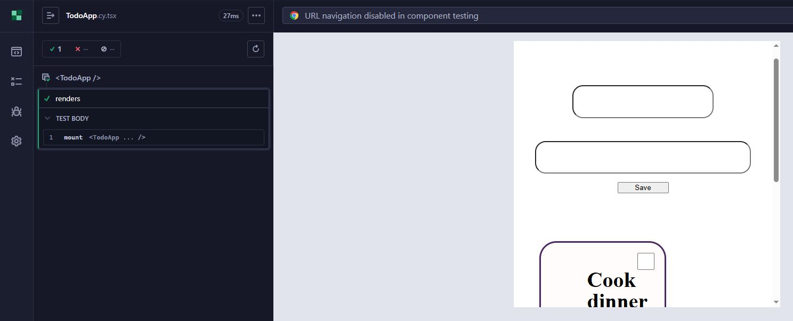
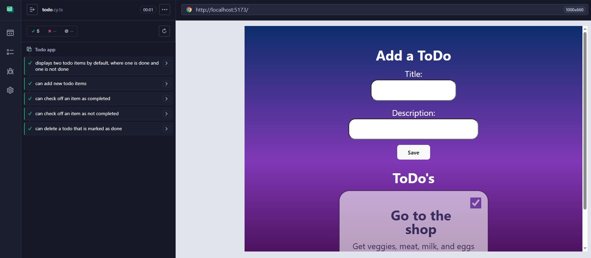
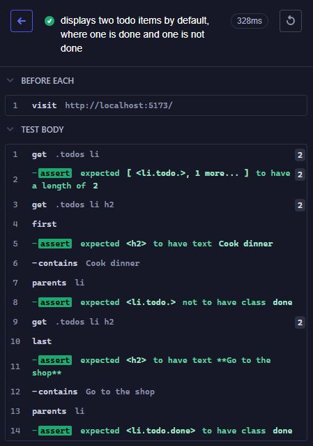
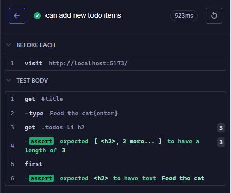
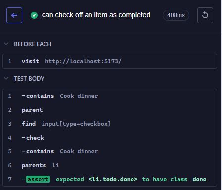
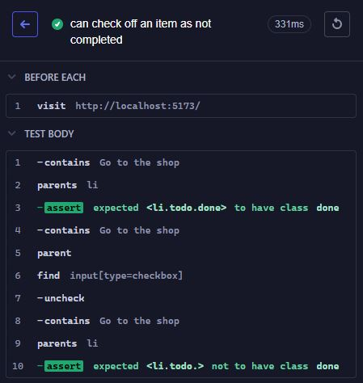
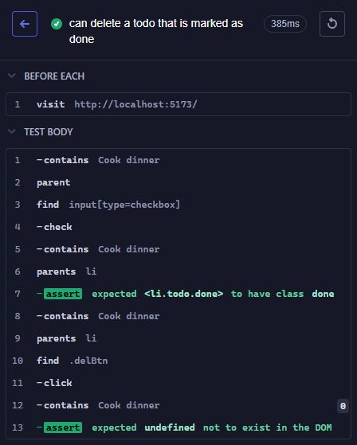

# Testning - inlämning 2
Assignment 2 in the course "Testning"
In this assignment we were tasked with doing E2E tests on a To Do app with the help of Cypress.
We had specific requirements for the tests we should run, being:
- The application should mount
- There should be two example Todos from the beginning, where one is marked as done, and one is not
- It should be possible to add a new Todo
- It should be possible to remove a todo
- You should be able to toggle the state (done/not done) for the Todo

As such, I started by checking so that the app would mount by using a component test.
As you can see below, it passed without any problem.

After that I got to work on writing the End to End test, and made sure they all worked exactly as they should.
In the end they all passed easily, and the results can be seen below.

## Test 1 ✔️
### Display two example Todos from the beginning, where one is marked as done, and one is not
[Link to test 1](./cypress/e2e/todo-test/todo.cy.ts#L8)

## Test 2 ✔️
### Can add a new Todo
[Link to test 2](./cypress/e2e/todo-test/todo.cy.ts#L25)

## Test 3 ✔️
### Can set Todo to "Done" 
[Link to test 3](./cypress/e2e/todo-test/todo.cy.ts#L37)

## Test 4 ✔️
### Can set Todo to "Not Done" 
[Link to test 4](./cypress/e2e/todo-test/todo.cy.ts#L49)

## Test 5 ✔️
### Can delete a todo that is marked as "Done"
[Link to test 5](./cypress/e2e/todo-test/todo.cy.ts#L65)

